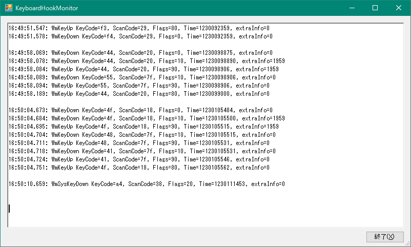
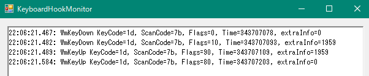

# KeyboardHookMonitor

Windows で Keyboard のグローバルフックを仕掛け、採取したキーボード入力情報を表示します。

下図は、「やまぶきR」と「KanchokuWS」を起動した後、MS IME を ON にして、
"d", "o" と打鍵したときのキーボード入力を表示しています。
「飛鳥」配列で「うは」と入力されています。

ちなみに、 extraInfo=1959 となっているのが KanchokuWS からの SendInput によるキー送出で、
ScanCode=7f となっているのがやまぶきRからのキー送出です。

また下図は「無変換」キーを押したときの出力です。

「KeyCode=1d」のところが仮想キーコードとなります。この例では「無変換」キーの仮想キーコードが
16進数の 1d であることが分かります。

## インストール
[リリースページ](https://github.com/oktopus1959/KeyboardHookMonitor/releases)から \*.zip ファイルをダウンロードして適当な場所で解凍します。

## 起動
KeyboardHookMonitor.exe をダブルクリックで起動してください。あるいは CMD.EXE から起動してください。

## 終了
「終了」ボタンをクリックするか「×」をクリックしてください。

## 謝辞
当ツールは、下記サイトからソースを引用しています。

https://aonasuzutsuki.hatenablog.jp/entry/2018/10/15/170958

サイトの作者 AonaSuzutsuki 様にお礼を申し上げます。
